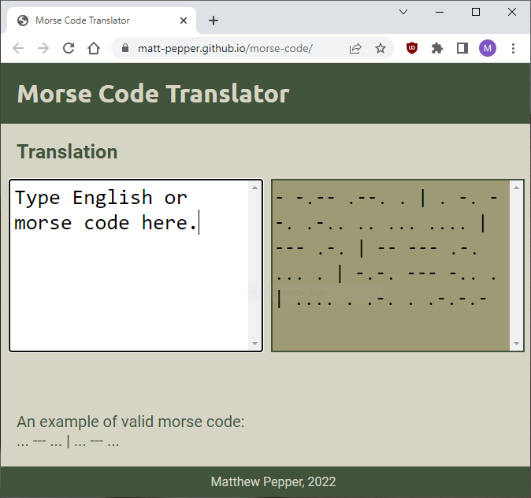

# Morse Code Translator



## [Link to website](https://matt-pepper.github.io/morse-code/)

## Using tests
- clone project
- install dependencies 
```
npm install
```
- running tests
```
npm test
```


## Challenges
Some challenges I faced while creating this project is:
- Getting the input to correctly swap from english to morse using Regex
- Getting the input to correctly translate
